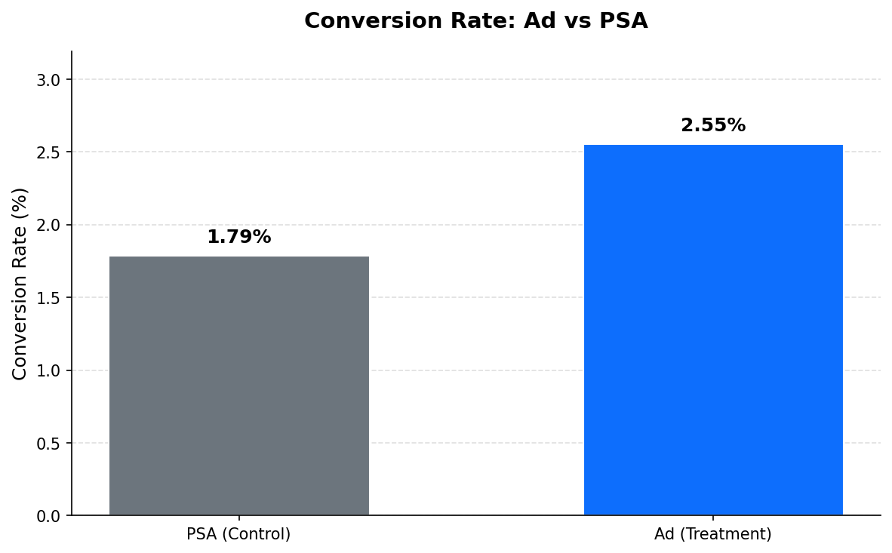
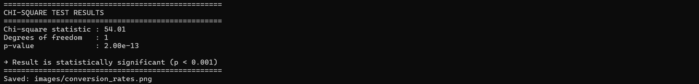

# Marketing A/B Test Analysis with Microsoft SQL Server

## Overview

This project analyses a marketing A/B test dataset containing 588,101 user records from an e-commerce campaign. Users were exposed to either a promotional advertisement (`ad`) or a public service announcement (`psa`). The dataset captures whether each user converted, how many ads they saw, and the day and hour when they received the most impressions.

**Key business question:**  
> Does showing the ad significantly increase the conversion rate compared to the PSA?

## Approach

I loaded the raw CSV into Microsoft SQL Server and performed the entire exploratory analysis in T-SQL before validating the result with a chi-square test in Python.

The analysis followed a deliberate sequence:

1. **Data quality & group balance** – I first checked for nulls and unexpected values, then examined the split between the two groups. The groups are heavily imbalanced (≈96 % ad vs 4 % PSA), which I noted early so I could interpret later results with appropriate caution.
2. **Primary metric** – Conversion rate by group, absolute lift, and relative lift were calculated directly in SQL.
3. **Secondary segmentation** – I bucketed users by ad frequency to see whether conversion rate rises with exposure, and I examined day-of-week and hour-of-day patterns to identify the strongest performance windows.
4. **Statistical validation** – Counts of converted vs non-converted users were extracted from SQL and fed into a chi-square test to confirm that the observed difference is unlikely to be due to chance.

All intermediate decisions (handling of the `BIT` data type, correct window-function syntax for medians, ordered day/hour sorting, etc.) are documented inside the SQL scripts.

## Findings


- The **ad group converted at 2.55 %** while the **PSA group converted at 1.79 %**.
- This represents an **absolute lift of 0.77 percentage points** and a **relative lift of approximately 43 %**.
- A chi-square test confirmed the difference is **statistically significant** (p ≪ 0.001).
- Conversion rate increases consistently with ad frequency, reaching **≈17 %** among users who saw 100+ ads.
- **Monday** and the **14:00–16:00** and **20:00–21:00** windows show the strongest conversion performance.

Taken together, the results indicate that the promotional ad drives meaningfully higher conversions than the PSA, with clear time-of-day and frequency effects that can inform future campaign scheduling.

## Limitations

Several caveats should be kept in mind when interpreting these results:

- The experimental groups are **heavily imbalanced** (96 % ad vs 4 % PSA). While the chi-square test mathematically accounts for unequal sample sizes, the small control group still limits precision and statistical power on the PSA side.
- The dataset does **not contain information on how users were assigned** to the ad or PSA groups. If assignment was not truly random—for example, if high-intent buyers were systematically shown more ads—the strong correlation between ad frequency and conversion may not be causal.
- No demographic or behavioural attributes (age, location, prior purchase history, device type, etc.) are available, so it is impossible to check whether the lift is consistent across customer segments or to control for potential confounding variables.

These limitations mean the findings should be treated as strong directional evidence rather than definitive causal proof.

## Dataset

This project uses the publicly available Mall Customer Segmentation Dataset from Kaggle.

Dataset:  https://www.kaggle.com/datasets/faviovaz/marketing-ab-testing

- **Rows**: 588,101  


| Column          | Description                                      |
|-----------------|--------------------------------------------------|
| `user_id`       | Unique user identifier                           |
| `test_group`    | `ad` (treatment) or `psa` (control)              |
| `converted`     | Whether the user converted (1 = Yes, 0 = No)     |
| `total_ads`     | Number of ads the user was exposed to            |
| `most_ads_day`  | Day of the week with the highest ad impressions  |
| `most_ads_hour` | Hour of the day with the highest ad impressions  |


---

## Tech Stack

- **Microsoft SQL Server** (T-SQL)
- **SQL Server Management Studio (SSMS)**
- **Python** (`scipy`) – for the chi-square statistical test
---

## Repository Structure

```text
A-B-Test-Ad-vs.-PSA/
├── data/
│   └── marketing_AB.csv
├── sql/
│   ├── create_table.sql
│   └── ab_test_analysis.sql
├── python/
│   └── statistical_test.py
├── images/
│   └── screenshot_statistical_test.png
│   └── conversion_rates.png
└── README.md
```

## How to Run the Project

## 1. Create the database and table
Run the script:
```sql
create_table.sql
```

## 2. Load the data
Use SQL Server Import Wizard 

## 3. Run the full analysis
```sql
   ab_test_analysis.sql
```
   
The script is divided into clear sections:
1. Data quality checks
2. Group balance
3. Conversion rates
4. Absolute & relative lift
5. Counts for statistical testing
6. Ads volume analysis
7. Day-of-week analysis
8. Hour-of-day analysis
9. Final summary table

## 4. Statistical Test (Python)
```python
 python statistical_test.py
```




## 5.Key Results
| Metric          | Value                                      |
|-----------------|--------------------------------------------------|
| `Ad conversion rate` | 2.55%                           |
| `PSA conversion rate`    | 1.79%              |
| `Absolute lift`     | +0.77 pp     |
| `Relative lift`     | +43%            |
| `Chi-square statistic`  | Very high  |
| `p-value` | << 0.001  |

Conclusion: The difference is statistically significant. Showing the advertisement meaningfully increases conversion rate compared to the PSA.

## 6. Skills Demonstrated

- Database and table creastion aswell as data loading into SQL Server (Import Wizard)
- Data quality validation
- Exploratory analysis with window functions and CTEs
- Calculation of conversion rates, lift, and confidence-ready metrics
- Proper handling of BIT data type
- Statistical hypothesis testing (chi-square)
- Clean, well-documented, production-style SQL


## 7. Future Improvements

- Add confidence intervals for the lift in pure T-SQL
- Build a simple Power BI / Tableau dashboard on top of the results
- Segment the analysis by user behaviour (high vs low ad exposure)
- Automate the entire pipeline with a stored procedure

Author

Mathyas

Data Analyst

Feel free to reach out with any questions.
